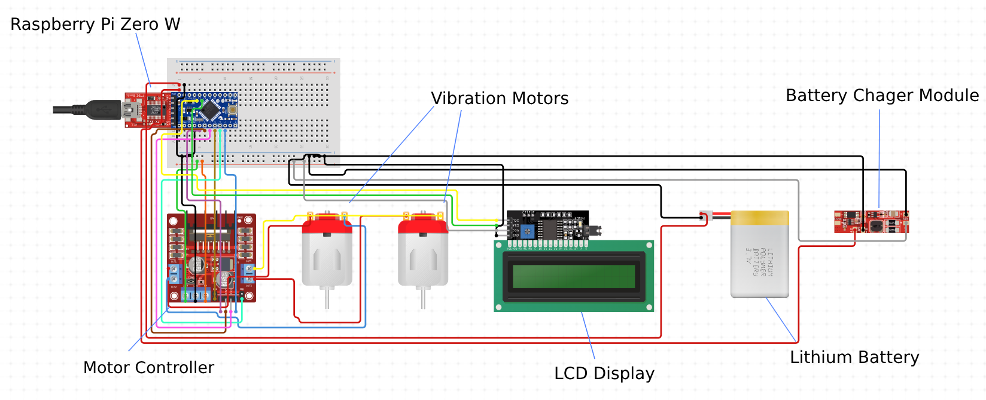

# Tempus Zero - Silent Haptic Alarm Watch

A wearable silent alarm system using Raspberry Pi Zero W with integrated haptic motors and real-time clock display, designed to wake users without disturbing others in shared living spaces.

##Overview

**Tempus Zero** (Latin: "Time Zero") is a prototype smart alarm watch that uses **haptic feedback** instead of sound to wake users. Perfect for:
- Shared bedrooms (dorms, family homes)
- Partners with different schedules  
- Light sleepers who don't want to disturb others
- People with hearing impairment

## Main Features

### Hardware
- **Raspberry Pi Zero W**: Compact embedded system with WiFi connectivity
- **Dual Haptic Motors**: Adafruit DRV2605 controlled vibration
- **16x2 LCD Display**: Real-time clock with alarm time display
- **Lithium-Ion Battery**: 3.7V rechargeable with PowerBoost 1000 charging module
- **3D-Printed Enclosure**: Ergonomic design for sleep comfort (Fusion 360)

### Software
- **Python-based firmware**: I2C communication for motor control and display
- **Customizable alarm strength**: Three intensity levels (Low, Medium, High)
- **Real-time clock**: Continuous time display with alarm monitoring
- **SSH configuration**: Remote setup via Raspberry Pi controller app

### User Experience
- Set alarm time and vibration strength via app
- LCD shows current time and configured alarm
- Silent haptic wake-up at specified time

## System Architecture

### Hardware Components

| Component | Model | Purpose |
|-----------|-------|---------|
| Microcontroller | Raspberry Pi Zero W | Main processing unit |
| Haptic Driver | Adafruit DRV2605 | Motor control with 119 vibration effects |
| Vibration Motors | Generic 3V motors (×2) | Haptic feedback generation |
| Display | 16x2 LCD (I2C) | Time and alarm display |
| Battery | 3.7V LiPo 2000mAh | Power supply |
| Charger | Adafruit PowerBoost 1000 | Battery management |
| Enclosure | Custom 3D print | Wearable housing |

### Circuit Design

The system uses I2C communication protocol to minimize GPIO pin usage:
- **I2C Bus 3**: DRV2605 haptic motor controller
- **I2C Bus 1**: 16x2 LCD display
- **Power distribution**: 5V from PowerBoost to all components
- **Motor output**: Dual vibration motors in parallel




## Main Implementation

### Core Haptic Functionality 

```python
# Initialize I2C bus and haptic driver
i2c = I2C(3)
drv = adafruit_drv2605.DRV2605(i2c)

# Set vibration effect based on user preference
if strength == "Low":
    drv.sequence[0] = adafruit_drv2605.Effect(119)
elif strength == "Medium":
    drv.sequence[0] = adafruit_drv2605.Effect(1)
else:  # High
    drv.sequence[0] = adafruit_drv2605.Effect(47)

# Main alarm loop
while True:
    current_time = str(datetime.now().time())[0:5]
    if current_time == alarm_time:
        drv.play()  # Activate haptic feedback
    display.lcd_display_string(current_time, 2)
    sleep(1)
```


## 🔧 Technical Specifications

**Power:**
- Input: 5V USB-C (charging)
- Battery: 3.7V 2000mAh LiPo
- Runtime: ~8-12 hours continuous operation
- Charging: 2-3 hours via PowerBoost 1000

**Dimensions:**
- Watch module: 60mm × 40mm × 25mm
- Wrist strap: Adjustable fabric band
- Total weight: ~85g

**Communication:**
- WiFi: 802.11 b/g/n (2.4GHz)
- I2C: Bus 1 (display), Bus 3 (haptic controller)

## Future Improvements
- [ ] Snooze and gradual wake features
- [ ] Sleep tracking integration
- [ ] Waterproof enclosure design
- [ ] Smaller form factor (custom PCB)

## 🤝 Team Contributions

**Oleksandra Kovalenko**: Embedded programming, 3D modeling/CAD (Fusion 360), enclosure design
**Siddhant Bhatnagar**: Circuit design, soldering, hardware assembly  
**Kushal Mamillapalli**: I2C implementation, system integration  
